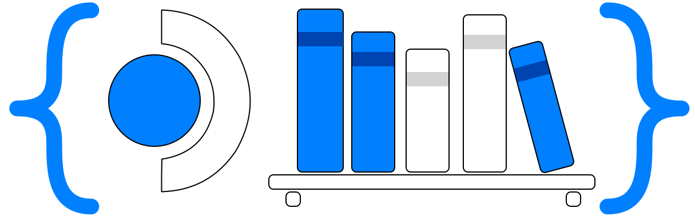

# @deck-shelves/api

<div align="center">

<p>
  
</p>

[](https://github.com/santojon/Deck-Shelves-API/actions/workflows/ci.yml)
[](https://github.com/santojon/Deck-Shelves-API/actions/workflows/release.yml)
[](https://www.npmjs.com/package/@deck-shelves/api)
[](https://www.npmjs.com/package/@deck-shelves/api)
[](https://www.npmjs.com/package/@deck-shelves/api)
[](src/index.test.ts)
[](src/types.ts)
[](https://bundlephobia.com/package/@deck-shelves/api)
[](LICENSE)
[](package.json)
[](https://github.com/ValveSoftware/SteamOS)
[](https://github.com/santojon/Deck-Shelves)
[](https://github.com/santojon/Deck-Shelves-API/network/members)
[](https://github.com/santojon/Deck-Shelves-API/graphs/traffic)
[](https://github.com/sponsors/santojon)
[](https://ko-fi.com/santojon)

</div>

TypeScript API for integrating with [Deck Shelves](https://github.com/santojon/Deck-Shelves) — a Decky plugin that injects configurable shelves into the Steam Deck home screen.

External plugins register sources, smart sources, context-aware sources, filter types, sort options, import flows, saved filters, search providers, side-menu entries, context / widget / shelf-renderer / metadata / statistics / recommendation providers through this surface; Deck Shelves consumes the registrations as if they were first-party. Consumers can also read profiles, integrations, settings snapshots and environment info, and react to host load/unload via `onReady` / `onTeardown`.

## Install

```bash
npm install @deck-shelves/api
# or
pnpm add @deck-shelves/api
# or
yarn add @deck-shelves/api
```

The package is **dependency-free** (no runtime dependencies, only TypeScript types at build time) and ships both ESM (`.mjs`) and CJS (`.cjs`) builds alongside type declarations.

## Quick start

```ts
import { register } from "@deck-shelves/api";

const off = register({
  name: "my-plugin",
  version: "1.0.0",
  onMount(api) {
    // Register a custom source that other shelves can reference
    api.registerShelfSource({
      id: "my-plugin/recently-rated",
      label: "Recently rated",
      async resolve(limit) {
        const data = await fetch("/api/my-plugin/ratings").then((r) => r.json());
        return data.appids.slice(0, limit);
      },
    });

    // React to focus changes on DS shelves
    api.subscribeFocusedCard((info) => {
      if (!info) return;
      console.log("focused", info.appid, "on shelf", info.shelfId);
    });

    // Build asset URLs without re-implementing Steam's fallback chain
    const heroes = api.getAssetUrls(620, "hero");
    // → ['https://steamloopback.host/assets/620/library_hero.jpg?c=...', ...]
  },
  onUnmount() {
    // Cleanup any cached API references — the api object passed to
    // onMount becomes stale after this.
  },
});

// Call `off()` when your plugin unloads.
```

## How it works

The package handles three timing cases automatically — your code doesn't branch on whether Deck Shelves is already loaded:

1. **DS already loaded** → calls `register` synchronously.
2. **DS loads later** → queues your integration and registers it on the `deck-shelves:ready` event.
3. **Your module loads after the ready event fired** → still registers from the pending queue when DS drains.

The returned `Unsubscribe` works regardless of which case applied.

## Context-aware shelf sources

A regular `registerShelfSource` source is static — its `resolve(limit)` doesn't know what the user is looking at. `registerContextAwareShelfSource` also passes the currently-focused game and an `AbortSignal`, so a source like "similar to the focused game" doesn't need to subscribe to `subscribeFocusedCard` itself or manage its own refresh timing — Deck Shelves owns observing focus changes, invalidating the shelf, and cancelling a stale in-flight `resolve()` for you:

```ts
api.registerContextAwareShelfSource({
  id: "my-plugin/similar-to-focused",
  label: "Similar to this game",
  context: { requiresFocusedApp: true }, // skip resolve() while nothing's focused
  async resolve(limit, params, context, signal) {
    if (!context?.focusedAppid) return [];
    const res = await fetch(`/api/similar/${context.focusedAppid}?limit=${limit}`, { signal });
    return (await res.json()).appids;
  },
});
```

`resolve` stays call-compatible with the plain `resolve(limit)` shape (`params`/`context`/`signal` are all optional), so this doesn't change anything for existing `registerShelfSource` sources.

## Capability matrix

| Surface                | Method                              | Snapshot                  | Subscribe                  |
| ---------------------- | ----------------------------------- | ------------------------- | -------------------------- |
| Regular shelf sources  | `registerShelfSource`               | `getShelves`              | `subscribeShelves`         |
| Smart shelf sources    | `registerSmartShelfSource`          | `getSmartShelves`         | `subscribeSmartShelves`    |
| Context-aware shelf sources | `registerContextAwareShelfSource` | `getRegisteredContextAwareShelfSources` | —          |
| Filter types           | `registerFilterType`                | `getRegisteredFilterTypes`| —                          |
| Sort options           | `registerSortOption`                | `getRegisteredSortOptions`| —                          |
| Import / Export types  | `registerImportType` / `registerExportType` | `getRegisteredImportTypes` | —                  |
| Saved filters          | `registerSavedFilter`               | `getSavedFilters`         | `subscribeSavedFilters`    |
| Search providers (v4)  | `registerSearchProvider`            | `getRegisteredSearchProviders` | —                     |
| Side-menu entries (v4) | `registerSideMenuProvider`          | `getRegisteredSideMenuProviders` | —                   |
| Context providers (v4) | `registerContextProvider`           | `getRegisteredContextProviders` | —                    |
| Widget providers (v4)  | `registerWidgetProvider`            | `getRegisteredWidgetProviders`  | —                    |
| Shelf renderers (v4)   | `registerShelfRenderer`             | `getRegisteredShelfRenderers`   | —                    |
| Metadata providers (v4)| `registerMetadataProvider`          | `getRegisteredMetadataProviders`| —                    |
| Statistics providers   | `registerStatisticsProvider`        | `getRegisteredStatisticsProviders` | —                 |
| Recommendation providers | `registerRecommendationProvider`  | `getRegisteredRecommendationProviders` | —             |
| Profiles               | —                                   | `getProfiles` / `getActiveProfile` | `subscribeProfiles`  |
| Integrations           | —                                   | `getIntegrations`         | `subscribeIntegrations`    |
| Settings snapshot      | —                                   | `getSettingsSnapshot`     | `subscribeSettingsSnapshot`|
| Focus tracking         | —                                   | `getFocusedCard`          | `subscribeFocusedCard`     |
| Manual shelf refresh   | `refreshShelf(shelfId)`             | —                         | —                          |
| Asset URLs             | `getAssetUrls(appid, type)`         | —                         | —                          |
| Built-in catalogues    | `listTriggerCatalog` / `listShelfTemplates` / `listShortcuts` | — | —      |
| Environment probes     | `getEnvironment` (incl. `.os`) / `hasTabMaster` | —             | —                          |
| Lifecycle helpers      | `onReady(cb)` / `onTeardown(cb)` (package exports) | —          | —                          |

Full surface in [`src/types.ts`](src/types.ts) → `DeckShelvesPublicAPI`.

## Direct API access (advanced)

Most consumers don't need this, but for short-lived scripts (CDP probes, dev tools, one-shot scripts that don't want lifecycle management):

```ts
import { getApi, isReady } from "@deck-shelves/api";

if (isReady()) {
  const api = getApi();
  api?.getShelves();
}
```

## Version policy

The `version` field on `DeckShelvesPublicAPI` bumps on every breaking change (currently `4`). Consumers should check `api.version` if they need to gate on a specific surface revision.

## Development

```bash
corepack enable
pnpm install
pnpm run check   # typecheck + lint + test
pnpm run build   # ESM + CJS + .d.ts into dist/
```

Releases are automated from `main`: a tag-prefixed PR (`[FIX]`, `[FEATURE]`, `[REFACTOR]`, …) drives the version bump on merge, and the resulting `vX.Y.Z` tag publishes to npm with provenance.

See [CONTRIBUTING.md](CONTRIBUTING.md) for the full workflow and [SECURITY.md](SECURITY.md) for reporting issues.

## License

[MIT](LICENSE) © [santojon](https://github.com/santojon)

## About

Part of [Deck Shelves](https://github.com/santojon/Deck-Shelves), developed by [Jonathan Santos](https://github.com/santojon).

[](https://ko-fi.com/santojon)
